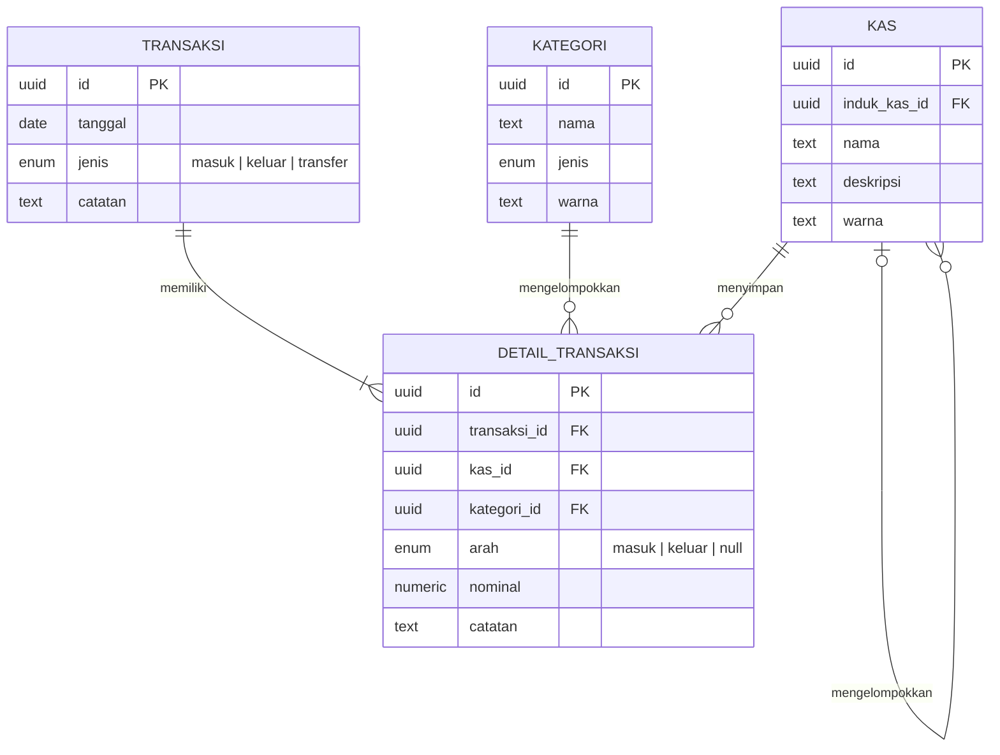

# Sistem Akuntansi Arus Kas Annisa Beno Tea House

Aplikasi pembukuan kas sederhana dengan antarmuka HTML/CSS/JavaScript, server Node.js tanpa dependensi eksternal, dan Supabase PostgreSQL sebagai penyimpanan terpusat. Data transaksi tidak disimpan di `localStorage`.

## Struktur

```text
frontend/
  html/index.html
  css/style.css
  css/jurnal-kas.css
  js/apps.js
backend/
  apps.js
  sql/database.sql
DOCS_SISTEM.docx
README.md
```

## Persiapan Supabase

1. Buat proyek di [supabase.com](https://supabase.com) dan simpan URL proyek serta API keys dari **Project Settings > API**.
2. Buka **SQL Editor**, tempel seluruh isi `backend/sql/database.sql`, lalu jalankan. Ini membuat empat tabel (`kas`, `kategori`, `transaksi`, `detail_transaksi`), relasi, indeks, kebijakan RLS, fungsi transfer atomik, dan akun/kategori awal.
  `Kas Utama` menjadi akun induk konsolidasi; `Kasir`, `Kas Operasional`, dan `Kas Cadangan` menjadi akun rincian di bawahnya. Untuk database yang sudah pernah dibuat, jalankan kembali skrip ini agar kolom `induk_kas_id` ditambahkan dan akun awal ditautkan.
  Skrip juga mengaktifkan `pg_cron` dan menjadwalkan setoran bersih Kasir ke Kas Utama setiap hari pukul **23.59 WIB**. Saldo nol atau negatif dilewati; jadwal database tetap berjalan walau aplikasi/browser ditutup.
3. Aktifkan **Anonymous Sign-ins** pada pengaturan Authentication Supabase (Authentication > Sign In / Providers > Anonymous). Aplikasi membuat sesi anonymous otomatis saat dibuka; tidak perlu akun staf atau email/kata sandi.

## Membuka index.html langsung

Untuk memakai aplikasi tanpa menjalankan Node.js, isi konstanta `directSupabaseConfig` di bagian atas `frontend/js/apps.js` dengan Project URL dan publishable/anon key dari **Project Settings > API**:

```js
const directSupabaseConfig = {
  url: '',
  anonKey: ''
};
```

Ganti nilai kosong `url` dan `anonKey` dengan nilai proyek Anda.

Simpan berkas tersebut, lalu buka `frontend/html/index.html` di browser. Mode ini menggunakan Supabase JS langsung dari browser, membuat sesi anonymous otomatis, lalu membuka dashboard. Data operasional tetap berada di PostgreSQL; sesi hanya disimpan di memori halaman.

`anonKey`/publishable key memang digunakan di browser. Jangan pernah mengisi `service_role` atau secret key di berkas frontend. Jalankan SQL terlebih dahulu. Koneksi internet diperlukan untuk Supabase dan pustaka SDK dari CDN. Jika browser memblokir request dari halaman `file://` karena CORS, jalankan melalui server lokal seperti di bawah.

## Menjalankan dengan backend Node.js

Gunakan Node.js 18 atau lebih baru. Dari terminal PowerShell, atur variabel lingkungan untuk sesi terminal yang sama, lalu jalankan server:

```powershell
$env:SUPABASE_URL = "https://PROJECT-REF.supabase.co"
$env:SUPABASE_ANON_KEY = "SUPABASE_PUBLISHABLE_OR_ANON_KEY"
$env:SUPABASE_SERVICE_ROLE_KEY = "SUPABASE_SECRET_OR_SERVICE_ROLE_KEY"
$env:PORT = "3000"
node backend/apps.js
```

Buka **http://localhost:3000**; aplikasi membuat sesi anonymous dan langsung membuka dashboard. Variabel tersebut bisa diatur melalui konfigurasi environment/deployment host; tidak perlu membuat `.env` atau `.env.example`. Untuk menjalankan tanpa menyimpan nilai di shell, gunakan secret manager pada hosting.

### Deploy ke GitHub Pages

Repository ini menyediakan `index.html` di root sebagai pengarah ke aplikasi asli di `frontend/html/index.html`. Dengan demikian, GitHub Pages dapat menerbitkan branch tanpa folder `docs/` dan tanpa workflow GitHub Actions; source frontend tetap berada di `frontend/`.

1. Pastikan `directSupabaseConfig` di `frontend/js/apps.js` berisi Project URL dan publishable/anon key Supabase yang benar. Jangan gunakan `service_role` atau secret key di frontend.
2. Pada repository GitHub, buka **Settings > Pages**.
3. Di **Build and deployment**, pilih **Deploy from a branch**, pilih branch `main` dan folder `/(root)`, lalu simpan.
4. Setelah Pages aktif, buka URL yang ditampilkan pada **Settings > Pages**. `index.html` root akan mengarahkan ke halaman aplikasi.

Mode GitHub Pages memakai Supabase langsung; backend Node.js tidak perlu dijalankan untuk deployment statis ini.

### Kunci Supabase dan keamanan

- `SUPABASE_URL` adalah URL proyek, bukan URL SQL Editor.
- `SUPABASE_ANON_KEY` dipakai server untuk login dan memeriksa access token pengguna. Pada mode `file://`, isi publishable/anon key yang sama pada konstanta `directSupabaseConfig` di `frontend/js/apps.js`.
- `SUPABASE_SERVICE_ROLE_KEY` hanya berada di environment server. Jangan menaruhnya di HTML, JavaScript frontend, repositori publik, atau membagikannya kepada pengguna.
- Setiap endpoint data memvalidasi access token Supabase terlebih dahulu. Sesi anonymous dibuat otomatis dan token hanya disimpan di memori halaman, bukan `localStorage`.
- Tanpa layar login, siapa pun yang dapat membuka aplikasi bisa membuat sesi anonymous. Kebijakan RLS saat ini mengizinkan CRUD bagi role `authenticated`; batasi penggunaan ke lingkungan privat/lokal dan jangan publikasikan sebelum RLS diubah untuk membatasi akses.
- Server dan REST API Supabase harus diakses lewat HTTPS saat deployment. Batasi akun Auth hanya untuk staf yang berwenang dan rotasi key jika pernah terekspos.

## Fitur

- Sesi Supabase anonymous otomatis tanpa layar login.
- Ringkasan saldo gabungan, kas masuk/keluar hari ini, transaksi bulan berjalan, saldo per akun, aktivitas terakhir, dan ringkasan kategori.
- `Kas Utama` menampilkan konsolidasi saldo akun rinciannya; transaksi baru dicatat pada akun rincian dan total cafe tidak menjumlahkan saldo induk/anak dua kali.
- Buku Besar menampilkan transaksi yang dicatat langsung pada Kas Utama. Buka **Akun kas > Lihat transaksi** untuk melihat, menambah, mengubah, atau menghapus rincian transaksi masing-masing akun.
- CRUD akun kas dan kategori.
- Kartu akun kas membuka halaman rincian mutasi, saldo saat ini, arus masuk/keluar, dan transaksi terkait; Kas Utama mencakup transaksi seluruh akun turunannya.
- CRUD transaksi berisi kas masuk/keluar, transfer internal, tanggal, catatan, akun kas, kategori, dan nominal. Penghapusan transaksi menghapus seluruh detail terkait.
- Transfer antar kas mencatat debit sumber dan kredit tujuan secara atomik dalam satu transaksi; mutasi internal mengubah saldo per kas tanpa dihitung sebagai pendapatan/pengeluaran cafe.
- Saldo positif Kasir otomatis disetor ke Kas Utama setiap hari pukul 23.59 WIB melalui Supabase Cron.
- Dua jenis laporan: **Laporan Gabungan Seluruh Kas** dan **Laporan Per Akun Kas**. Laporan per akun menyediakan pilihan Semua Kas atau satu akun tertentu dan hanya menghitung detail dengan `kas_id` akun terpilih.
- Jurnal Kas menampilkan buku besar per akun dengan saldo berjalan; saldo awal periode dihitung dari mutasi sebelum tanggal mulai. Cetak tersedia per akun atau rekap semua akun tanpa menambah entitas database.
- Jurnal Kas membuka Semua Kas dan laporan membuka seluruh riwayat yang ada secara default; rentang tanggal manual tetap dihormati.
- Jurnal Kas tersedia pada `/jurnal-kas`; cetak akun pada `/cetak/kas/{id}` dan rekap pada `/cetak/kas-semua`. Saldo awal dihitung dari histori, sehingga struktur empat tabel tetap.
- Laporan per rentang tanggal menyediakan arus bersih, rekap kategori/akun, rincian transaksi, ekspor CSV, dan cetak. Penjualan menyimpan rincian nama minuman/produk pada setiap transaksi, misalnya Latte atau Americano.
- Pada kategori Penjualan, isi kolom nama minuman/produk pada setiap transaksi, misalnya Caffe, Latte, atau Americano. Rincian tersebut terlihat pada buku kas dan laporan tanpa menambah tabel produk.
- Pencarian dan filter jenis/bulan pada buku arus kas.
- Empat entitas ERD: **Kas**, **Kategori**, **Transaksi**, **Detail Transaksi**.

Saldo berjalan dihitung dari total transaksi masuk dikurangi transaksi keluar; tidak ada angka saldo terpisah yang dapat tidak sinkron. `Kas Utama` menjumlahkan dirinya dan semua akun turunannya. Saldo keseluruhan hanya menjumlahkan akun tanpa induk agar rincian anak tidak dihitung dua kali. Transfer menyimpan dua detail berarah (keluar dari sumber, masuk ke tujuan) secara atomik dan tidak mengubah total pemasukan/pengeluaran usaha. Masukkan transaksi masuk untuk mencatat saldo awal bila dibutuhkan.

## ERD



## Catatan operasional

- Jika konfigurasi server atau berkas frontend belum lengkap, halaman menampilkan petunjuk cara melengkapinya dan menonaktifkan login sampai siap.
- Tabel menggunakan RLS dan hanya memberi akses kepada role `authenticated`. Server mengautentikasi pengguna sebelum memakai service-role key untuk permintaan database.
- Jangan membuka port server ini ke internet tanpa HTTPS, proteksi akses staf, dan secret management yang sesuai.
- Periksa jadwal otomatis di SQL Editor dengan `select jobname, schedule, active from cron.job where jobname = 'annisa-transfer-kasir-ke-utama-2359-wib';`. Riwayat eksekusi tersedia di `cron.job_run_details`.
- Aplikasi ini mencatat satu detail akun/kategori per transaksi dari formulir. Skema database mendukung beberapa detail pada satu transaksi untuk pengembangan berikutnya.
